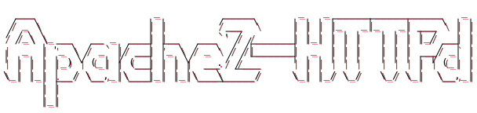

<!-- markdownlint-disable MD033 MD041 MD044-->
<p></p>
<!-- markdownlint-enable MD033 MD041 -->

# httpd

<!-- markdownlint-disable MD033 MD041 MD051 -->
<div>
  <h4 align="center">
    
    
    
    
  </h4>
</div>

<div align="center">


</div>

<div align="center"> <sub> Ascii svg art by <a href="https://GitHub.com/martinthomson/aasvg">aasvg</a>. </sub> </div>
<!-- markdownlint-enable MD033 MD041 MD051 -->

## Description

Среда для сборки контейнера с Apache HTTP Server на базе Astra Linux. Данный веб сервер относится к [сертифицируемой](https://wiki.astralinux.ru/pages/viewpage.action?pageId=302028564) сборке предлагаемой Astra Linux, т.к. поставка пакета происходит из основного репозитория (main).

Присоединяйтесь к нашим социальным сетям:

<!-- markdownlint-disable MD033 -->

<div class="badges-row-public">
  <h4 align="center">
    <a href="https://t.me/NGR_Softlab">
      
    </a>
    &emsp; &emsp; &emsp;
    <a href="https://www.ngrsoftlab.ru/?utm_source=tg&utm_medium=start" >
      
    </a>
  </h4>
</div>

<!-- markdownlint-enable MD033 -->

## Contents

- [httpd](#httpd)
  - [Description](#description)
  - [Contents](#contents)
  - [Supported Technologies](#supported-technologies)
  - [What is it](#what-is-it)
  - [How to work with](#how-to-work-with)
    - [Build variables](#build-variables)
  - [How to use this image](#how-to-use-this-image)
  - [How to test local](#how-to-test-local)
  - [Configuration](#configuration)
  - [SSL/HTTPS](#sslhttps)
  - [Issues and solutions](#issues-and-solutions)
  - [Miscellaneous](#miscellaneous)
    - [Cya!](#cya)

## [Supported Technologies](#contents)

<!-- markdownlint-disable MD033 -->
|                                                 OS                                                  |                                                      Apache2                                                      | Status             |
| :-------------------------------------------------------------------------------------------------: | :---------------------------------------------------------------------------------------------------------------: | :----------------- |
|  |  | ✅ Fully supported |

<div align="center"> <sub> Таблица 1. Поставляемые версии для контейнерных сред. </sub> </div>

<!-- markdownlint-enable MD033 -->

## [What is it](#contents)

Dockerfile для сборки Apache в Astra Linux

## [How to work with](#contents)

Для начала работы необходимо установить [pre-commit](https://pre-commit.com/) и хуки

```console
$ pip install pre-commit
$ pre-commit --version

pre-commit 4.2.0

$ pre-commit install

pre-commit installed at .git/hooks/pre-commit
pre-commit installed at .git/hooks/commit-msg
pre-commit installed at .git/hooks/pre-push
```

> [!warning]
> Чтобы проверить свои изменения, воспользуйтесь командой `pre-commit run --all-files`.
> Чтобы проверить конкретную задачу, воспользуетесь командой `pre-commit run <target> --all-files`.
> Если Вы понимаете что творите и хотите пропустить проверку `pre-commit`-ом воспользуйтесь `--no-verify`, пример `git commit -m "Добавил изменения и не хочу проверки" --no-verify`

Собрать образ `Astra Linux based`

```shell
## Image build
export ASTRA_VERSION='1.8.x-slim'
export APACHE_HTTPD_VERSION="2.4.65-astra${ASTRA_VERSION}"

## Apache image:
docker build \
    --progress=plain \
    --no-cache \
    -t httpd:"${APACHE_HTTPD_VERSION}" \
    .
```

### [Build variables](#contents)

| Имя              | Значение по умолчанию |  Тип   |                                                                                    Описание |
| :--------------- | :-------------------: | :----: | ------------------------------------------------------------------------------------------: |
| `image_name`     |         astra         | string |                                                                                 Имя образа. |
| `image_registry` |          ''           | string | Адрес до реестра образа. Например: `--build-arg image_registry=my-container-registry:1111/` |
| `image_version`  |      1.8.x-slim       | string |                                                                              Версия образа. |
| `httpd_identity` |        2.4.65         | string |                                                                 Ожидаемая версия httpd[^1]. |
| `version`        |         1.0.0         | float  |                                                     Версия выпуска минимального контейнера. |

<!-- markdownlint-disable MD033 -->
<div align="center"> <sub> Таблица 2. Переопределяемые аргументы для Dockerfile. </sub> </div>
<!-- markdownlint-enable MD033 -->

> [!tip]
> Проверка доступных версий приложения -
> `apt show apache2`,
> `apt-cache policy apache2`,
> `apt-cache show apache2`

## [How to use this image](#contents)

Для того чтобы начать использовать данный образ, создайте `Dockerfile` с простыми настройками

```Dockerfile
FROM httpd:2.4.65-astra1.8.x-slim
COPY static-html-directory /var/www/html
```

Затем соберите и запустите полученный образ

```console
$ docker build -t some-content-httpd .
$ docker run --name some-httpd -d some-content-httpd

...run logic...
```

## [How to test local](#contents)

Простой тест:

```shell
$ docker run --rm -p 80:80 httpd:2.4.65-astra1.8.x-slim

$ curl -s -i -w "\nStatus code: %{http_code}\n" http://localhost

...
httpd header
httpd body
httpd status code
```

Хостинг простой статики:

```shell
docker run --rm -d --name some-httpd -p 8080:80 -v /some/content:/var/www/html:ro httpd:2.4.65-astra1.8.x-slim
```

## [Configuration](#contents)

Для создания своего пользовательского конфига httpd сервера воспользуйтесь командой ниже и получите конфигурационный файл, который используется по умолчанию

```shell
docker run --rm httpd:2.4.65-astra1.8.x-slim cat /etc/apache2/apache2.conf >my-httpd.conf
```

После модификаций просто **скопируйте** его в свой образ

```Dockerfile
FROM httpd:2.4.65-astra1.8.x-slim
COPY ./my-httpd.conf /etc/apache2/apache2.conf
```

## [SSL/HTTPS](#contents)

При необходимости передачи веб-трафика по SSL, простейший способ настройки - это **скопировать** или **монтировать** пользовательские **server.crt**, **server.key** и [файл конфигурации](configuration/httpd-ssl.conf) внутрь образа

- Создать пользовательские самоподписанные сертификаты

    ```shell
    mkdir -p ./certs

    openssl req -x509 -nodes -days 365 \
      -newkey rsa:2048 \
      -keyout ./certs/server.key \
      -out ./certs/server.crt \
      -subj "/C=RU/ST=Test/L=Test/O=TestOrg/CN=localhost" \
      -addext "basicConstraints=critical,CA:FALSE" \
      -addext "keyUsage=digitalSignature,keyEncipherment" \
      -addext "extendedKeyUsage=serverAuth"

    chmod 600 ./certs/server.key
    chmod 644 ./certs/server.crt
    sudo chown -R 999:999 certs/
    ```

- Собрать образ

    ```shell
    docker build \
      --progress=plain \
      --no-cache \
      -f Dockerfile.ssl \
      -t httpd:ssl \
      .
    ```

- Запустить проверку

    ```shell
    docker run -d \
      --name httpd-ssl \
      -p 8080:8080 \
      -p 8443:8443 \
      -v $(pwd)/certs:/certs:ro \
      httpd:ssl
    ```

- Проверить из консоли

    ```shell
    ## Проверить HTTPS
    curl -k https://localhost:8443

    ## Проверить сертификат
    openssl s_client -connect localhost:8443 -servername localhost 2>/dev/null | openssl x509 -noout -subject -issuer

    ## Проверить на защиту от XST атак - должен вернуть 405 или 403
    curl -k -X TRACE https://localhost:8443/

    ## Проверить на посторонние методы - должен вернуть 405 или 403
    curl -k -X PUT https://localhost:8443/

    ## Проверить сервер - должен показать 'Server: Apache'
    curl -I http://localhost:8080/
    ```

> [!tip]
> Рекомендую более подробно ознакомиться с [конфигурационным файлом](configuration/httpd-ssl.conf). В нём отражены неплохие практики оформления ssl/secure для веб-сервера

## [Issues and solutions](#contents)

- При необходимости включить логи отладки запросов, например отладки websocket, стоит использовать следующую конструкцию:

    ```conf
    # apache2.conf
    LogLevel alert proxy:trace4 ssl:info
    ```

- При необходимости аудита подключения, можно воспользоваться `tcpdump`-ом

    ```shell
    tcpdump -i any -nn port 8080
    tcpdump -i lo -nn port 8443
    ```

- Для того чтобы обновить конфигурационный файл внутри контейнера необходимо воспользоваться командой

    ```shell
    docker exec -it <my-httpd-container> kill -USR1 1
    ```

## [Miscellaneous](#contents)

Лого для проекта создано при помощи [`aasvg`](https://github.com/martinthomson/aasvg) проекта. Вы можете создать такое же и/или модифицировать имеющееся. Для этого воспользуйтесь [сайтом](https://patorjk.com/software/taag/#p=display&f=Doom) или установите `figlet`. Если Вы используете способ с установкой `figlet`, то вдобавок необходимо сказать необходимый шрифт, например я использую `Doom`. Далее, необходимо воспользоваться `aasvg` и конвертировать `ascii` арт в `svg`. Обратите внимание - по умолчанию будет svg в красном цвете, чтобы изменить цвет, необходимо изменить его определение [тут](docs/images/logo.svg#L128). Конвертация цвета происходит по следующему принципу - `%23D42029`, где `%23` это закодированный URL символ #, итоговое получаемое значение `#D42029`

```console
$ curl 'http://www.figlet.org/fonts/doom.flf' -o /usr/share/figlet/doom.flf
$ curl 'http://www.figlet.org/fonts/larry3d.flf' -o /usr/share/figlet/larry3d.flf
$ figlet -f doom 'Apache2-HTTPd'

  ___                   _          _____       _   _ _____ ___________   _
 / _ \                 | |        / __  \     | | | |_   _|_   _| ___ \ | |
/ /_\ \_ __   __ _  ___| |__   ___`' / /______| |_| | | |   | | | |_/ __| |
|  _  | '_ \ / _` |/ __| '_ \ / _ \ / /|______|  _  | | |   | | |  __/ _` |
| | | | |_) | (_| | (__| | | |  __./ /___     | | | | | |   | | | | | (_| |
\_| |_| .__/ \__,_|\___|_| |_|\___\_____/     \_| |_/ \_/   \_/ \_|  \__,_|
      | |
      |_|

$ aasvg --source --embed < ./docs/ascii.txt > docs/images/logo.svg
```

<!-- markdownlint-disable MD033 MD041 MD051 -->
<table align="center"><tr><td align="center" width="9999">


<div align="center"> <sub> Apache feather logo, symbolizing the Apache Software Foundation's focus on distributed systems, open collaboration, and the "Apache Way". </sub> </div>

### [Cya!](#contents)

</td></tr></table>
<!-- markdownlint-enable MD033 MD041 MD051 -->

---

[^1]: 🛠️ За счёт скрипта [`httpd-install-approximately.sh`](scripts/httpd-install-approximately.sh) нас может не волновать полная версия httpd, мы можем передавать лишь приблизительно желаемую версию, а скрипт позаботится чтобы была выбрана последняя и актуальная из списка
